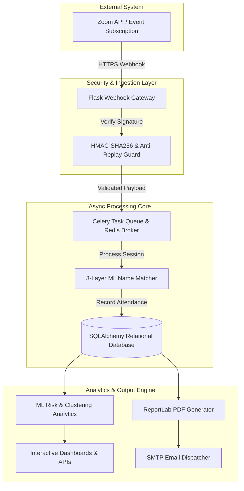
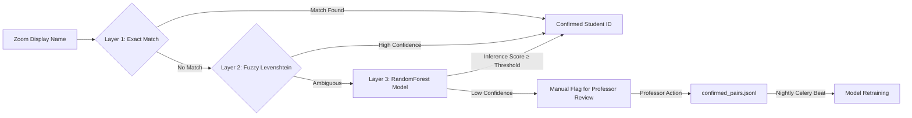

<div align="center">

  <h1>🎓 EduTrack</h1>
  <p><b>Enterprise-Grade Student Attendance Engine & ML Analytics Platform</b></p>

  <p><i>Automated Zoom Webhook Processing • 3-Layer Machine Learning Matcher • Behavioral Risk Analytics • Automated PDF Reporting</i></p>

  <p>
    
    
    
    
    
    
  </p>

  <p>
    
  </p>

  <p>
    <a href="#-executive-overview">Overview</a> •
    <a href="#-key-features">Features</a> •
    <a href="#-system-architecture">Architecture</a> •
    <a href="#-ml--analytics-engine">ML Engine</a> •
    <a href="#-tech-stack">Tech Stack</a> •
    <a href="#-quick-start">Quick Start</a> •
    <a href="#-zoom-integration">Zoom Setup</a>
  </p>

</div>

---

## ⚡ Executive Overview

**EduTrack** transforms academic attendance tracking by bridging real-time video conferencing telemetries with machine learning precision. By capturing Zoom Server-to-Server webhooks, executing multi-tiered participant identification, and evaluating predictive risk metrics, EduTrack transitions attendance management from manual verification into an automated, zero-touch operational pipeline.

| Traditional Manual Tracking | EduTrack Automated Intelligence |
| :--- | :--- |
| ❌ Manual roster cross-referencing & high error margin | ✅ **Automated 3-layer ML name matching** (Exact + Fuzzy + ML) |
| ❌ Single join-time capture ignores mid-meeting drops | ✅ **Cumulative active duration calculation** across re-joins |
| ❌ Delayed insight into chronic absenteeism | ✅ **Real-time student risk scoring & behavioral clustering** |
| ❌ Manual administrative report compile workflows | ✅ **Instant automated PDF report generation & SMTP distribution** |

---

## ✨ Key Features

### 📡 Real-Time Zoom Webhook Engine
- Ingests Zoom lifecycle webhooks (`meeting.started`, `meeting.ended`, `participant_joined`, `participant_left`).
- Features a built-in event-driven state machine managing participant leave/re-join sequences to accurately accumulate active attendance duration against configurable thresholds.

### 🤖 3-Layer Machine Learning Matcher
- Resolves Zoom display names to official course rosters through a cascading pipeline: **Exact String Match** $\rightarrow$ **Fuzzy Levenshtein Distance** $\rightarrow$ **Pre-Trained RandomForest Classifier** (trained on 10,000 synthetic pairs; $\ge$90% target accuracy).
- Integrates a human-in-the-loop active feedback system: professor adjustments are captured to `confirmed_pairs.jsonl` for automated nightly retraining via Celery Beat.

### 📊 Predictive Risk & Behavioral Analytics
- Dynamically calculates student attendance risk profiles and behavioral clusters (`High Risk`, `Moderate Risk`, `Consistent`).
- Powers an interactive administrative dashboard equipped with Chart.js REST endpoints and Excel (`.xlsx`) bulk roster import capabilities.

### ⚙️ Asynchronous Task & Report Pipeline
- Decouples long-running operations via a Celery & Redis task architecture.
- Generates post-session PDF performance summaries using ReportLab and dispatches automated notifications via SMTP.

### 🛡️ Enterprise Security & Signature Verification
- Enforces strict security standards using HMAC-SHA256 signature verification for Zoom webhooks, 5-minute replay attack protection windows, Werkzeug bcrypt password hashing, and database transaction rollback safety.

---

## 🏛️ System Architecture



---

## 🔬 ML & Analytics Engine

The core matching architecture resolves participant identity ambiguity using a 3-stage intelligence pipeline:



- **Active Learning Loop**: Every manual confirmation or rejection in the UI streams directly to local training datasets, allowing the RandomForest model to continually adapt to institution-specific naming conventions.

---

## 🛠️ Tech Stack

| Component | Technologies |
| :--- | :--- |
| **Core Framework** | `Flask 3.x` • `Werkzeug` • `Flask-Login` • `Flask-Mail` |
| **Machine Learning** | `Scikit-Learn (RandomForest)` • `NumPy` • `Pandas` |
| **Task Queue & Broker**| `Celery` • `Celery Beat` • `Redis 7` |
| **Database & ORM** | `SQLAlchemy` (6 Models) • `SQLite` / `PostgreSQL` |
| **Reporting & Frontend**| `ReportLab (PDF)` • `Chart.js` • `Bootstrap 5` • `Jinja2` |
| **DevOps & Testing** | `Docker` • `Docker Compose` • `Gunicorn` • `Pytest` |

---

## 🚀 Quick Start

### 1. Clone & Environment Setup
```bash
git clone https://github.com/vigneshaadepu/Zoom_attendance.git
cd Zoom_attendance

# Create and activate virtual environment
python -m venv venv
# Windows: venv\Scripts\activate | Unix: source venv/bin/activate

pip install -r requirements.txt
cp .env.example .env
```

### 2. Database Initialization & ML Model Seeding
```bash
python seed_db.py
```
> *Initializes all SQLAlchemy database tables, seeds a demonstration professor account (`dr.smith@university.edu` / `password123`), generates 30 student profiles across 5 sessions, trains the initial RandomForest ML model (`app/ml/name_matcher.pkl`), and calculates initial risk scores.*

### 3. Execution Modes

<details>
<summary><b>🔹 Mode A: Development / Single-Threaded Mode</b></summary>

```bash
python run.py
# Access dashboard at http://localhost:5000
```
</details>

<details>
<summary><b>🔹 Mode B: Production Async Stack (Docker & Celery)</b></summary>

```bash
# Launch Redis, Celery Worker, Celery Beat, and Flask Application
docker-compose up --build
```
</details>

---

## 📹 Zoom Integration & Simulation

### Webhook Simulator (Offline Testing)
Test the entire end-to-end pipeline without an active Zoom API connection:

```bash
# Execute standard lifecycle simulation
python simulate_zoom.py

# Execute custom simulation with parameters
python simulate_zoom.py --meeting-id 88001234567 --host dr.smith@university.edu --participants 15
```
> *The simulator emits `meeting.started`, simulates joins with fuzzy name variations and re-joins, fires `participant_left`, and triggers `meeting.ended` to initiate automated PDF generation.*

<details>
<summary><b>🔧 Zoom Server-to-Server OAuth Credentials Configuration</b></summary>

1. Register a **Server-to-Server OAuth App** in the [Zoom Marketplace](https://marketplace.zoom.us/).
2. Add required administrative scopes: `meeting:read:admin` and `report:read:admin`.
3. Configure **Event Subscriptions** pointing to your endpoint (`https://<domain>/webhook/zoom`) for:
   - `meeting.started`, `meeting.ended`, `meeting.participant_joined`, `meeting.participant_left`
4. Set `.env` credentials:
   ```env
   ZOOM_ACCOUNT_ID=your_account_id
   ZOOM_CLIENT_ID=your_client_id
   ZOOM_CLIENT_SECRET=your_client_secret
   ZOOM_WEBHOOK_SECRET_TOKEN=your_verification_token
   ```
</details>

---

## 🧪 Testing & Quality Assurance

Enforce software reliability across webhook verification, attendance accumulation, and ML matching:

```bash
# Run full test suite with Pytest
pytest tests/ -v

# Run targeted test modules
pytest tests/test_matching.py -v
pytest tests/test_attendance.py -v
pytest tests/test_webhook.py -v

# Generate HTML code coverage report
pytest tests/ --cov=app --cov-report=html
```

---

## 🔒 Security Infrastructure

- **HMAC-SHA256 Validation**: Rejects unauthenticated payload tampering at the API gateway layer.
- **Anti-Replay Defense**: Enforces strict 5-minute timestamp bounds to neutralize replay vulnerabilities.
- **Credential Protection**: Uses Werkzeug bcrypt hashing for credential storage; environment secrets strictly isolated from source control.

---

<div align="center">
  <sub>Built with Flask 3.x, Scikit-Learn, Celery, Redis, ReportLab, and Bootstrap 5.</sub>
</div>
