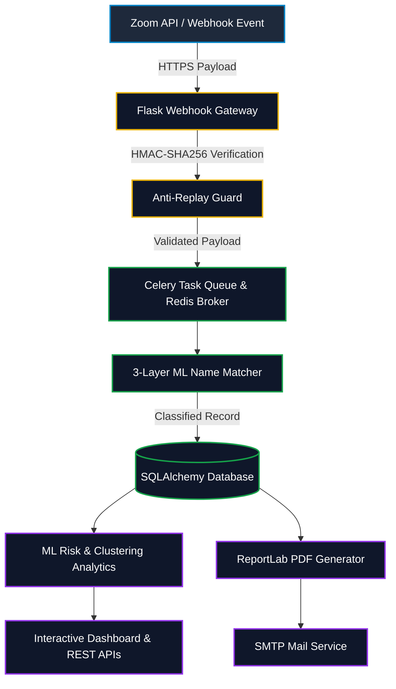

<div align="center">

  <h1>🎓 EduTrack</h1>
  <p><b>Enterprise-Grade Student Attendance Engine & ML Analytics Platform</b></p>

  <p><i>Automated Zoom Webhooks • 3-Layer Machine Learning Matcher • Behavioral Risk Analytics • Automated PDF Reporting</i></p>

  <p>
    <a href="https://python.org"></a>
    <a href="https://flask.palletsprojects.com"></a>
    <a href="https://scikit-learn.org"></a>
    <a href="https://docs.celeryq.dev"></a>
    <a href="https://redis.io"></a>
    <a href="https://docker.com"></a>
  </p>

  <p>
    <a href="https://git.io/typing-svg"></a>
  </p>

  <br/>

  <p>
    <a href="#-executive-overview"></a>
    <a href="#-flagship-capabilities"></a>
    <a href="#-system-architecture"></a>
    <a href="#-ml--matching-pipeline"></a>
    <a href="#-technology-stack-matrix"></a>
    <a href="#-quick-start--installation"></a>
  </p>

</div>

---

## ⚡ Executive Overview

> [!IMPORTANT]  
> **EduTrack** replaces error-prone manual attendance taking with an enterprise-grade, event-driven pipeline. By seamlessly capturing real-time Zoom telemetries, running multi-stage machine learning identity resolution, and generating predictive risk analytics, EduTrack turns raw meeting events into actionable academic intelligence.

<table width="100%">
  <tr>
    <th width="50%" align="center">❌ Traditional Manual Tracking</th>
    <th width="50%" align="center">✅ EduTrack Intelligent Engine</th>
  </tr>
  <tr>
    <td>
      • Manual roster cross-referencing with high error margin<br/>
      • Single join-time snapshot ignores mid-session drops<br/>
      • Delayed visibility into student absenteeism trends<br/>
      • Labor-intensive administrative report compilation
    </td>
    <td>
      • <b>3-Layer ML Name Matcher</b> (Exact + Fuzzy + RandomForest)<br/>
      • <b>Cumulative duration tracking</b> across leave/re-join events<br/>
      • <b>Real-time student risk scoring & behavioral clustering</b><br/>
      • <b>Automated PDF generation & scheduled SMTP dispatch</b>
    </td>
  </tr>
</table>

---

## ✨ Flagship Capabilities

<table width="100%">
  <tr>
    <td width="50%" valign="top">
      <h3>📡 Real-Time Webhook Engine</h3>
      
      <br/><br/>
      Captures Zoom lifecycle events (<code>started</code>, <code>ended</code>, <code>joined</code>, <code>left</code>). Uses an event-driven state machine to handle participant drops and re-joins, accurately accumulating active presence duration.
    </td>
    <td width="50%" valign="top">
      <h3>🤖 3-Layer ML Name Matcher</h3>
      
      <br/><br/>
      Cascading resolution pipeline: <b>Exact Match</b> $\rightarrow$ <b>Fuzzy Levenshtein</b> $\rightarrow$ <b>RandomForest Classifier</b> (10k synthetic pairs). Features human-in-the-loop active feedback logged to <code>confirmed_pairs.jsonl</code>.
    </td>
  </tr>
  <tr>
    <td width="50%" valign="top">
      <h3>📊 Risk & Behavioral Analytics</h3>
      
      <br/><br/>
      Calculates real-time risk scores and groups students into behavioral clusters (<i>High Risk</i>, <i>Moderate Risk</i>, <i>Consistent</i>). Powered by Chart.js REST endpoints and bulk Excel (<code>.xlsx</code>) imports.
    </td>
    <td width="50%" valign="top">
      <h3>⚙️ Async Pipeline & PDF Engine</h3>
      
      <br/><br/>
      Offloads heavy post-session workflows via Celery workers. Compiles professional ReportLab PDF reports and automatically emails summaries via SMTP.
    </td>
  </tr>
</table>

---

## 🏛️ System Architecture



---

## 🔬 ML & Matching Pipeline

Identity resolution follows a 3-tier cascade to eliminate manual name matching overhead:

<table width="100%">
  <tr>
    <th width="25%">Layer 1: Exact Match</th>
    <th width="25%">Layer 2: Fuzzy Distance</th>
    <th width="25%">Layer 3: RandomForest</th>
    <th width="25%">Active Feedback</th>
  </tr>
  <tr>
    <td align="center">
      <br/><br/>
      Direct normalized string equivalence check.
    </td>
    <td align="center">
      <br/><br/>
      Calculates string distance for minor typos.
    </td>
    <td align="center">
      <br/><br/>
      Evaluates complex patterns (10k sample model).
    </td>
    <td align="center">
      <br/><br/>
      Nightly retraining via Celery Beat tasks.
    </td>
  </tr>
</table>

<br/>

> [!TIP]
> **Human-in-the-Loop Feedback**: When a professor confirms or rejects a name suggestion in the UI, the result is saved to `app/ml/train_data/confirmed_pairs.jsonl`. The scheduled Celery Beat task automatically retrains the RandomForest model nightly.

---

## 🛠️ Technology Stack Matrix

| Domain | Integrated Technologies & Tooling |
| :--- | :--- |
| **Backend Framework** |     |
| **Machine Learning** |    |
| **Async & Infrastructure** |    |
| **Database & ORM** |    |
| **Reporting & Frontend** |    |
| **DevOps & Testing** |    |

---

## 🚀 Quick Start & Installation

### 1. Repository Setup
```bash
git clone https://github.com/vigneshaadepu/Zoom_attendance.git
cd Zoom_attendance

# Initialize virtual environment
python -m venv venv
# Windows: venv\Scripts\activate | Unix: source venv/bin/activate

pip install -r requirements.txt
cp .env.example .env
```

### 2. Database & ML Initialization
```bash
python seed_db.py
```
> [!NOTE]
> `seed_db.py` creates database schema tables, inserts demo professor credentials (`dr.smith@university.edu` / `password123`), generates 30 student records across 5 sessions, trains the RandomForest model (`app/ml/name_matcher.pkl`), and calculates behavioral risk scores.

### 3. Launch Application

<details>
<summary><b>🔥 Option A: Local Development Server</b></summary>
<br/>

```bash
python run.py
# Access Web Dashboard at http://localhost:5000
```
</details>

<details>
<summary><b>🐳 Option B: Full Production Container Stack (Docker & Celery)</b></summary>
<br/>

```bash
# Spins up Redis broker, Celery worker, Celery Beat scheduler, and Gunicorn application
docker-compose up --build
```
</details>

---

## 📹 Zoom Integration & Webhook Simulation

> [!TIP]
> **No Zoom Account Required for Testing**: Use the included simulation utility `simulate_zoom.py` to trigger full meeting lifecycles offline.

```bash
# Execute standard Zoom meeting simulation
python simulate_zoom.py

# Execute custom simulation with specific meeting parameters
python simulate_zoom.py --meeting-id 88001234567 --host dr.smith@university.edu --participants 15
```

<details>
<summary><b>🔑 Production Zoom Server-to-Server OAuth Configuration</b></summary>
<br/>

1. Build a **Server-to-Server OAuth App** in the [Zoom Marketplace](https://marketplace.zoom.us/).
2. Grant administrative scopes: `meeting:read:admin` and `report:read:admin`.
3. Enable **Event Subscriptions** pointing to `https://<your-domain>/webhook/zoom` for:
   - `meeting.started`, `meeting.ended`, `meeting.participant_joined`, `meeting.participant_left`
4. Configure `.env` keys:
   ```env
   ZOOM_ACCOUNT_ID=your_account_id
   ZOOM_CLIENT_ID=your_client_id
   ZOOM_CLIENT_SECRET=your_client_secret
   ZOOM_WEBHOOK_SECRET_TOKEN=your_verification_token
   ```
</details>

---

## 🧪 Testing & Security Infrastructure

<table width="100%">
  <tr>
    <td width="50%" valign="top">
      <h3>🛡️ Security Protections</h3>
      • <b>HMAC-SHA256</b> signature verification on all webhooks.<br/>
      • <b>5-Minute Anti-Replay</b> window to prevent payload replay attacks.<br/>
      • <b>Bcrypt Password Hashing</b> via Werkzeug.<br/>
      • <b>SQLAlchemy Rollbacks</b> on exception state.
    </td>
    <td width="50%" valign="top">
      <h3>🧪 Automated Testing</h3>
      <pre><code># Run full pytest suite
pytest tests/ -v

# Run targeted test suites
pytest tests/test_matching.py -v
pytest tests/test_webhook.py -v

# Code coverage report
pytest tests/ --cov=app</code></pre>
    </td>
  </tr>
</table>

<br/>

<div align="center">

  <hr style="border: 1px solid #1e293b; width: 100%;"/>

  <p><b>🎓 EduTrack Platform</b> • Enterprise Student Attendance Engine</p>
  <p><sub>Built with Flask 3.x, Scikit-Learn, Celery, Redis, ReportLab, and Bootstrap 5</sub></p>

</div>
