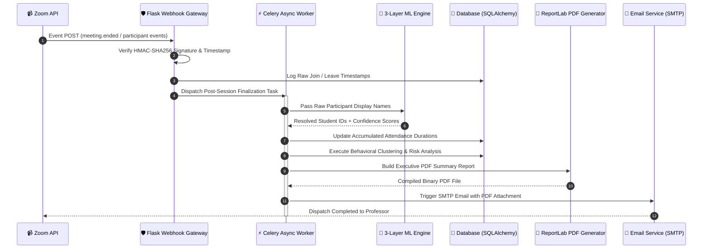

<div align="center">

# 🎓 EduTrack

### *Next-Generation Intelligent Student Attendance & Analytics Platform*

[](https://git.io/typing-svg)

<p align="center">
  <a href="#-executive-overview">Overview</a> •
  <a href="#-key-capabilities">Capabilities</a> •
  <a href="#-system-architecture">Architecture</a> •
  <a href="#-machine-learning-engine">ML Engine</a> •
  <a href="#-tech-stack">Tech Stack</a> •
  <a href="#-quick-start">Quick Start</a> •
  <a href="#-testing--simulation">Simulation</a>
</p>

[](https://www.python.org/)
[](https://flask.palletsprojects.com/)
[](https://scikit-learn.org/)
[](https://docs.celeryq.dev/)
[](https://redis.io/)
[](https://www.docker.com/)
[](https://marketplace.zoom.us/)

---

</div>

## 📌 Executive Overview

**EduTrack** transforms standard virtual classroom sessions into an automated, data-driven attendance ecosystem. By pairing **real-time Zoom Server-to-Server webhooks** with a multi-layered **machine learning name matcher**, EduTrack eliminates manual roll calls, handles guest nickname variations, calculates total active session durations, and automatically compiles production-grade PDF analytical reports distributed via email.

<table align="center">
  <tr>
    <td align="center" width="25%">
      <h3>⚡ Real-Time</h3>
      <p>Instant webhook event ingest & join duration tracking</p>
    </td>
    <td align="center" width="25%">
      <h3>🤖 ≥90% Accuracy</h3>
      <p>3-layer ML engine for noisy participant name resolution</p>
    </td>
    <td align="center" width="25%">
      <h3>📄 100% Automated</h3>
      <p>Background PDF report generation & SMTP dispatch</p>
    </td>
    <td align="center" width="25%">
      <h3>📊 Predictive</h3>
      <p>Risk scoring, behavioral clustering & trends</p>
    </td>
  </tr>
</table>

---

## ✨ Key Capabilities

| Feature | Description | Engineering Highlights |
| :--- | :--- | :--- |
| ⚡ **Real-Time Webhook Processing** | Listens to Zoom `meeting.started`, `participant_joined`, `participant_left`, and `meeting.ended` events. | HMAC-SHA256 signature verification, 5-minute replay prevention, session duration aggregation across multi-joins. |
| 🧠 **3-Layer ML Name Matcher** | Resolves informal Zoom display names (e.g. *"Matt S."* to *"Matthew Smith"*). | Deterministic Exact Match &rarr; Fuzzy Levenshtein Distance &rarr; **RandomForest Classifier** trained on 10,000 synthetic pairs. |
| 📈 **Student Behavioral Analytics** | Identifies disengaged students before grades drop. | Automated risk scoring, k-means behavioral clustering, and dynamic trend forecasting rendered with Chart.js. |
| 📜 **Automated PDF & Email Pipeline** | Generates executive attendance summaries upon meeting completion. | High-resolution ReportLab engine, background execution via Celery, and SMTP delivery via Flask-Mail. |
| 🔄 **Continuous Feedback Loop** | Learns from professor match approvals and rejections in the UI. | Retraining dataset stored in `.jsonl`, nightly Celery Beat cron job to retrain and update models seamlessly. |
| 🧪 **Zero-Dependency Simulator** | Built-in CLI simulator for development without live Zoom webhooks. | Emulates multi-participant joins/rejoins, name variations, and meeting lifecycle events end-to-end. |

---

## 🏗️ System Architecture

The sequence diagram below details the end-to-end lifecycle of an attendance session—from Zoom event trigger to post-session automated analytics dispatch.



---

## 🧠 Machine Learning Engine

EduTrack utilizes a hierarchical **3-Layer Resolution Strategy** to match noisy Zoom display names against official student rosters.

```
       Zoom Participant Display Name
                     │
                     ▼
          ┌─────────────────────┐
          │  Layer 1: Exact     │  ─── Match Found ───► [ High Confidence ]
          └─────────────────────┘
                     │ No Match
                     ▼
          ┌─────────────────────┐
          │  Layer 2: Fuzzy     │  ─── Ratio ≥ 85% ───► [ Medium-High Confidence ]
          └─────────────────────┘
                     │ Ratio < 85%
                     ▼
          ┌─────────────────────┐
          │ Layer 3: ML Engine  │  ─── ML Predict ───► [ Probabilistic Match / UI Review ]
          └─────────────────────┘
```

* **Layer 1 (Exact Match):** Direct string equality check against student full names and official emails.
* **Layer 2 (Fuzzy Match):** Normalized Levenshtein and Token Sort ratio evaluation for minor typos and character reversals.
* **Layer 3 (RandomForest Classifier):** Supervised scikit-learn model trained on 10,000 synthetic name pairs. Evaluates phonetic similarity, token overlaps, and character n-gram distance.
* **Human-in-the-Loop Feedback:** Professor confirmations/rejections in the dashboard are written to `confirmed_pairs.jsonl` and ingested by automated nightly retraining jobs.

---

## 💻 Tech Stack

<table align="center">
  <tr>
    <td width="20%" align="center"><b>Category</b></td>
    <td width="40%" align="center"><b>Technologies</b></td>
    <td width="40%" align="center"><b>Role & Purpose</b></td>
  </tr>
  <tr>
    <td align="center"><b>Core Backend</b></td>
    <td>
      
      
      
    </td>
    <td>Application framework, ORM models, and modular Blueprint route handlers.</td>
  </tr>
  <tr>
    <td align="center"><b>Machine Learning</b></td>
    <td>
      
      
      
    </td>
    <td>RandomForest classification model, synthetic data generation, and risk clustering.</td>
  </tr>
  <tr>
    <td align="center"><b>Async & Messaging</b></td>
    <td>
      
      
    </td>
    <td>Asynchronous background task processing queue and scheduled Celery Beat cron jobs.</td>
  </tr>
  <tr>
    <td align="center"><b>Reporting & UI</b></td>
    <td>
      
      
      
    </td>
    <td>Dynamic vector PDF generation, front-end analytics rendering, and responsive UI layout.</td>
  </tr>
  <tr>
    <td align="center"><b>DevOps & Testing</b></td>
    <td>
      
      
      
    </td>
    <td>Containerization orchestrator, automated test suites, and public HTTPS webhook tunneling.</td>
  </tr>
</table>

---

## ⚡ Quick Start

### 1. Repository Setup & Virtual Environment

```bash
# Clone the repository
git clone https://github.com/vigneshaadepu/Zoom_attendance.git
cd zoom_attendance

# Create and activate virtual environment
python -m venv venv

# Windows
venv\Scripts\activate
# macOS / Linux
source venv/bin/activate

# Install dependencies
pip install -r requirements.txt
```

### 2. Environment Configuration

```bash
cp .env.example .env
```

| Parameter | Required | Description | Default / Example |
| :--- | :---: | :--- | :--- |
| `SECRET_KEY` | Yes | Flask session encryption key | `change-me-in-production` |
| `DATABASE_URL` | Yes | Relational database connection string | `sqlite:///edutrack.db` |
| `ZOOM_ACCOUNT_ID` | Yes | Zoom Server-to-Server OAuth Account ID | From Zoom Marketplace |
| `ZOOM_CLIENT_ID` | Yes | Zoom Server-to-Server OAuth Client ID | From Zoom Marketplace |
| `ZOOM_CLIENT_SECRET` | Yes | Zoom Server-to-Server OAuth Client Secret | From Zoom Marketplace |
| `ZOOM_WEBHOOK_SECRET_TOKEN` | Yes | Zoom Event Verification Secret | From Zoom Event Subscription |
| `MAIL_SERVER` | No | SMTP Server for automated reports | `smtp.gmail.com` |
| `MAIL_PASSWORD` | No | App Password for email dispatch | `16-char-app-password` |

### 3. Initialize & Seed Database

```bash
python seed_db.py
```

> **Automated Seeding Pipeline:** Initializes database tables, creates demo instructor credentials (`dr.smith@university.edu` / `password123`), populates 30 students across 5 historical sessions, **trains the ML name matching model**, and computes risk scores.

### 4. Run Application

```bash
python run.py
```

Access the interactive dashboard at: `http://localhost:5000`

---

## 🎮 Testing & Webhook Simulation

You can evaluate the complete pipeline locally without configuring live Zoom credentials by utilizing the built-in simulator.

```bash
# Execute standard simulated meeting lifecycle
python simulate_zoom.py

# Custom simulation flags
python simulate_zoom.py --meeting-id 88001234567 --host dr.smith@university.edu --participants 15
```

```
[SIMULATOR] ─────────────────────────────────────────────────────────────
 1. POST meeting.started             ──► Session created in DB
 2. POST 12 participant_joined       ──► Emulates join & name noise
 3. POST participant re-joins        ──► Duration aggregation verified
 4. POST participant_left            ──► Exit timestamp registered
 5. POST meeting.ended               ──► Finalizes session & generates PDF
[SIMULATOR] Pipeline executed successfully.
```

### Test Suite Execution

```bash
# Run full automated test suite
pytest tests/ -v

# Run with test coverage report
pip install pytest-cov
pytest tests/ --cov=app --cov-report=html
```

---

## 🔄 Production & Asynchronous Deployment

For production setups requiring real-time async task offloading:

```bash
# Option A: Full Multi-Container Deployment (Recommended)
docker-compose up -d --build
```

```bash
# Option B: Manual Process Execution
# Terminal 1: Redis Broker
docker run -p 6379:6379 redis:7-alpine

# Terminal 2: Celery Worker
celery -A app.tasks.celery_app.celery worker --loglevel=info --pool=solo

# Terminal 3: Celery Beat Scheduler
celery -A app.tasks.celery_app.celery beat --loglevel=info

# Terminal 4: Production Web Server
gunicorn -w 4 -b 0.0.0.0:8000 "app:create_app('production')"
```

---

## 📁 Repository Structure

<details>
<summary><b>📂 View Directory Layout</b></summary>

```gcode
zoom_attendance/
├── app/
│   ├── __init__.py          # Flask Application Factory
│   ├── config.py            # Environment configurations (Dev/Prod/Test)
│   ├── extensions.py        # SQLAlchemy, LoginManager, Mail instances
│   ├── models.py            # SQLAlchemy database models
│   ├── routes/              # Modular application blueprints
│   │   ├── auth.py          # Authentication & session controls
│   │   ├── dashboard.py     # Analytics & visual charts
│   │   ├── students.py      # Roster management & Excel parser
│   │   ├── sessions.py      # Attendance session management
│   │   ├── reports.py       # PDF download and report endpoints
│   │   ├── webhook.py       # Signed Zoom webhook gateway
│   │   └── api.py           # REST endpoints for Chart.js
│   ├── services/            # Core business logic domain
│   │   ├── zoom_auth.py     # OAuth token lifecycle management
│   │   ├── zoom_webhook.py  # HMAC-SHA256 signature verification
│   │   ├── attendance.py    # Duration calculation logic
│   │   ├── matching.py      # 3-Layer ML matching engine
│   │   ├── report_gen.py    # ReportLab PDF compilation
│   │   ├── email_service.py # Automated SMTP dispatch
│   │   └── ml_analytics.py  # Risk scoring & behavioral clustering
│   ├── tasks/               # Celery asynchronous workers
│   │   ├── celery_app.py    # Celery configuration & beat schedule
│   │   ├── finalize_session.py # Post-meeting pipeline
│   │   └── retrain_models.py   # Continuous ML retraining job
│   ├── ml/                  # Machine learning artifacts & scripts
│   │   ├── train_matcher.py # Model training script
│   │   ├── name_matcher.pkl # Serialized RandomForest model
│   │   └── train_data/      # JSONL feedback datasets
│   ├── templates/           # Jinja2 HTML templates
│   └── static/              # CSS, JS, generated PDF reports
├── tests/                   # Pytest automated test suites
├── seed_db.py               # Database seeder & initial ML training
├── simulate_zoom.py         # End-to-end webhook event simulator
├── docker-compose.yml       # Production orchestration
├── Dockerfile               # App container definition
└── requirements.txt         # Python dependency manifest
```

</details>

---

## 🛡️ Security & Integrity Safeguards

* **HMAC-SHA256 Webhook Verification:** Validates incoming HTTP header signatures using your Zoom Secret Token to ensure payload authenticity.
* **Replay Attack Prevention:** Enforces strict 5-minute timestamp tolerance on incoming webhook payloads.
* **Cryptographic Credentials:** User passwords hashed using industry-standard `bcrypt` via Werkzeug.
* **Transactional Reliability:** Webhook DB operations execute inside isolated atomic transactions with automatic rollback handling.

---

<div align="center">

### 🌟 Designed for Excellence in Modern Academic Operations

Crafted with **Flask**, **scikit-learn**, **Celery**, **ReportLab**, and **Bootstrap**.

[](https://github.com/vigneshaadepu/Zoom_attendance)
[](https://github.com/vigneshaadepu/Zoom_attendance)

</div>
