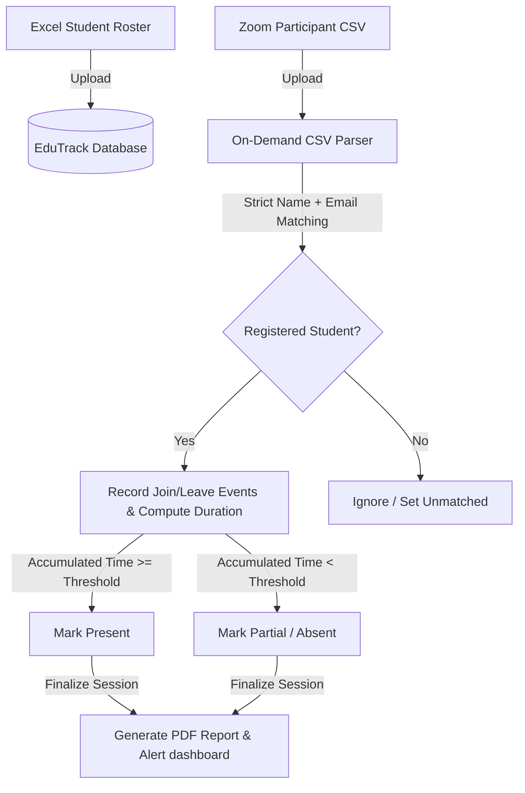

# EduTrack — System Workflow Guide

EduTrack is an intelligent Student Attendance Management System that matches Zoom Participant logs against a registered roster using strict verification rules. Below is a comprehensive guide to how the system works and how data flows through the application.

---

## 1. High-Level Architecture
EduTrack is built on a modular full-stack Python Flask architecture:

---

## 2. Step-by-Step System Workflow

### Step 1: Register Students (Roster Upload)
1. The professor uploads an Excel file (`.xlsx` or `.xls`) containing the class roster.
2. **Required Columns**: 
   * `Full Name` (Official registered name)
   * `Email` (Official student email)
   * `Student ID` (Unique identifier)
3. The parser processes rows, skips duplicate emails, defaults the course enrollment code to `"ALL"`, and inserts students into the database.

### Step 2: Upload Zoom Participant Logs
1. After a Zoom meeting ends, the professor exports the **Participant Report** directly from the Zoom Web Portal as a `.csv` file.
2. The professor names the session (e.g. *"Lecture 1: Intro to Python"*) and uploads the CSV via the **Upload Zoom CSV** screen.
3. The uploader parses the CSV headers, automatically mapping columns like `Name (Original Name)`, `User Email`, `Join Time`, `Leave Time`, and `Duration (Minutes)`.

### Step 3: Strict Attendance matching
For every participant row in the Zoom CSV, the matching engine runs the following logic:
1. **Normalization**: Display names are normalized (lowercase, accent symbols stripped, parentheses or pipe suffixes removed).
2. **Strict Matching Constraint**: 
   * The system compares the Zoom `User Email` and Zoom `Name` against the registered student roster.
   * **Both must match perfectly**. If either the name or email differs (e.g., name matches but email is unrecognized), the engine rejects the match to avoid false credentials.
3. Unmatched attendees or students not present in the CSV are logged as **Absent**.

### Step 4: Duration Accumulation
If a student disconnects and re-joins multiple times during the meeting:
1. The engine stacks all their `Join Time` and `Leave Time` timestamps.
2. It calculates the difference for each segment and sums them up into a **Total Duration (Minutes)**.
3. If the total duration is equal to or greater than the session threshold (default: **60 minutes**), the student's status is set to **✓ Present**.
4. If they attended for less than the threshold, their status is set to **⚠ Partial**.

### Step 5: Finalization & Reporting
1. Once all student records are updated, the session status is changed to `"completed"`.
2. The system triggers the **ReportLab PDF generator** to compile a printable, high-contrast, structured attendance report detailing the session metrics and charts.
3. The new session data immediately populates the **Analytics Dashboard**, updating KPIs, attendance trend charts, and the student risk matrix.
